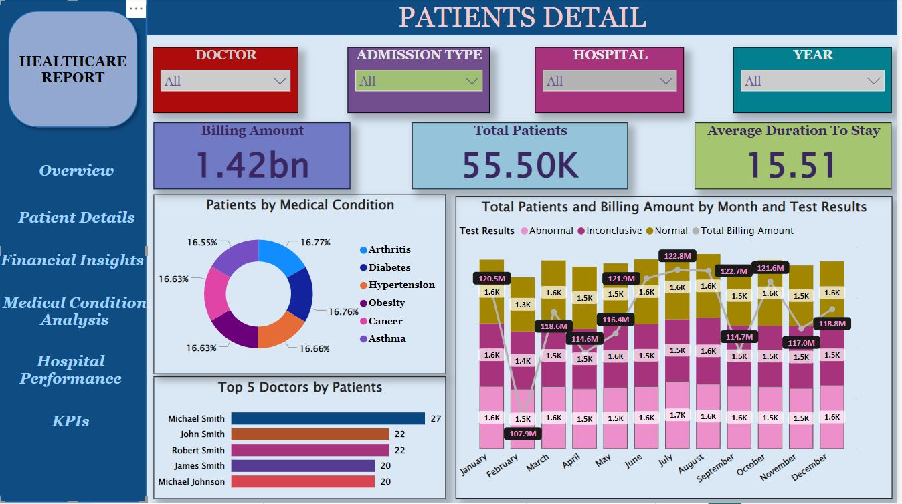
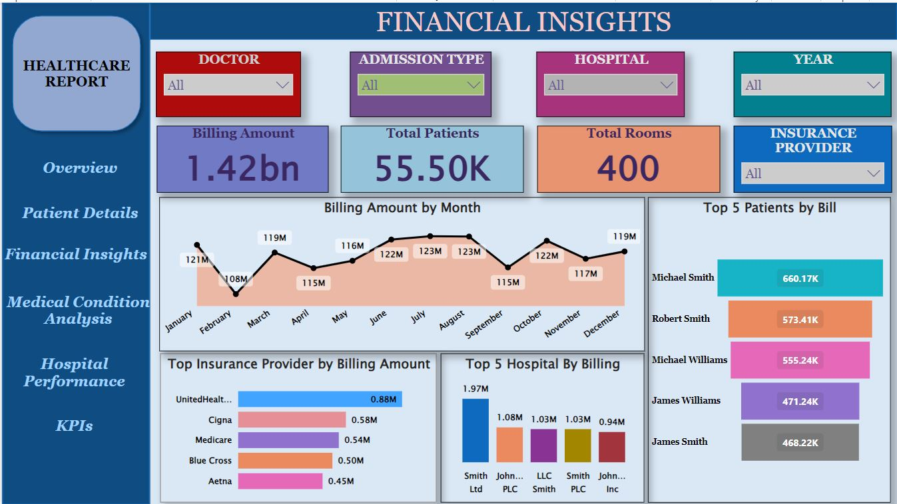
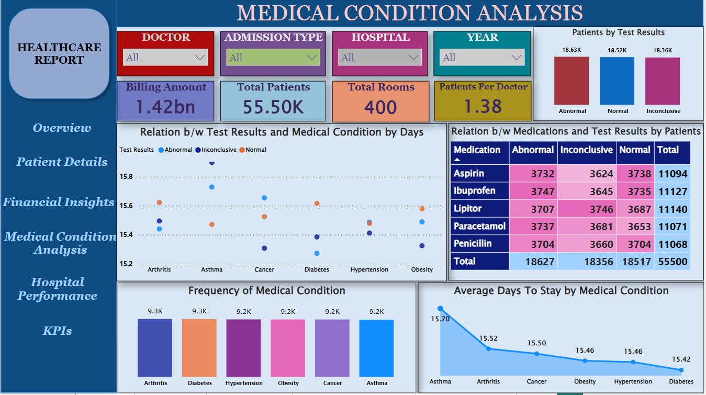
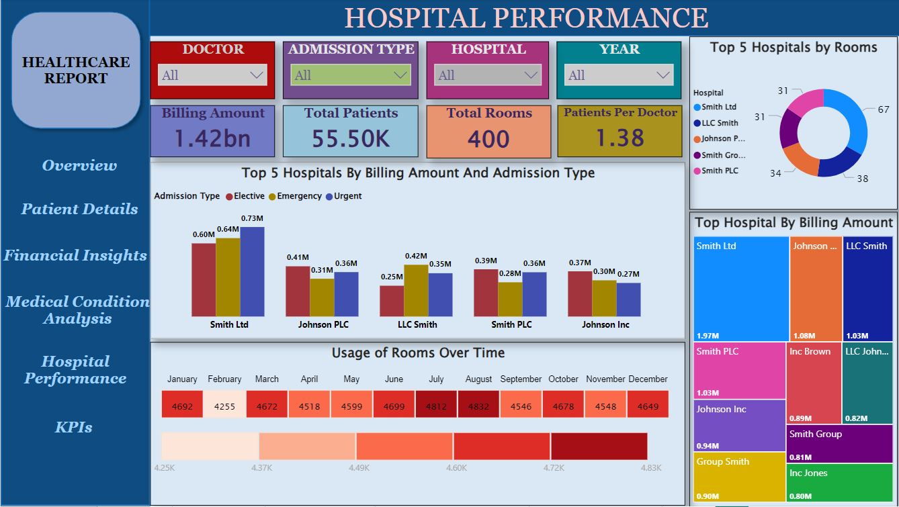
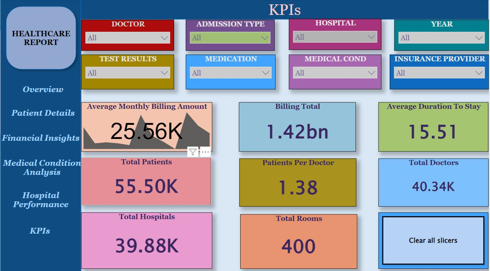

# Healthcare_Data_Analytics

-Dedicated to creating and experimenting with interactive data visualizations, transforming raw data into compelling visual stories.
This Power BI project presents a comprehensive dashboard that integrates and visualizes key healthcare data, including patient details, hospital information, payment records, doctor assignments, room utilization, test results, diagnoses, and patients' medication. The data is cleaned and preprocessed using Python to ensure consistency and accuracy across multiple datasets. Advanced DAX queries are employed to calculate key performance indicators (KPIs) related to patient care, hospital operations, financial performance, and medication management. These KPIs provide insights into patient flow, treatment outcomes, medication usage, resource allocation, and financial health. The dashboard enables healthcare administrators to make data-driven decisions that optimize hospital performance, enhance patient care, improve medication management, and streamline operational efficiency.
This dashboard consist of 6 pages.

## OVERVIEW
-The Overview/Dashboard provides a snapshot of key metrics and trends in hospital operations. It tracks the total number of unique patients, average length of stay, and total billing amounts. Visuals like pie or bar charts display admission type breakdowns (e.g., Emergency, Routine), while room occupancy trends illustrate hospital utilization. Filters allow users to refine data based on date range, hospital, and admission type for deeper insights.

## PATIENTS DETAILS

The detailed view offers patient-level information, including medical condition, length of stay, billing amount, room number, and attending doctor. Filters enable users to focus on specific doctors, room numbers, or medical conditions for a more tailored analysis. Conditional formatting is applied to highlight long stays and high billing amounts, making it easy to identify outliers. This layout provides a comprehensive and insightful look at patient data for better decision-making and monitoring.

## FINANCIAL INSIGHTS

The Financial Insights section focuses on tracking the hospital's financial performance and identifying billing trends. Key visuals include a bar or column chart displaying billing amounts by insurance provider, a comparative analysis of billing by hospital, and a list of the top 10 high billing cases. A line chart shows billing trends over time, segmented by month or week, to identify fluctuations. Filters allow users to drill down by insurance provider, hospital, and admission type for more detailed financial analysis.

## MEDICAL CONDOTION ANALYSIS

The Medical Condition Analysis section aims to identify trends related to patient diagnoses and outcomes. It highlights the frequency of top medical conditions, tracks the average duration of stay for specific conditions, and correlates conditions with discharge outcomes, such as recovery times or test results. Filters for medical condition, admission type, and doctor allow for focused insights into how different conditions are treated and managed, helping improve care and identify areas for improvement.

## HOSPITAL PERFORMANCE

The Hospital Performance section helps evaluate hospital and room utilization, as well as doctor efficiency. Key visuals include tracking room occupancy over time, monitoring the number of patients managed by each doctor, and analyzing admission types across different hospitals. It also provides a comparison of billing performance across hospitals to highlight areas of strength or concern. Filters for date range, doctor, and hospital allow for focused analysis, enabling a deeper understanding of hospital operations and performance.

## KPIs
The KPIs (Key Performance Indicators) page provides a snapshot of critical metrics to assess hospital performance. It tracks essential factors like patient volume, average length of stay, occupancy rate, and financial performance, offering insights into both operational efficiency and patient care quality. By monitoring these indicators, hospitals can make data-driven decisions to improve care, optimize resources, and enhance financial outcomes.

