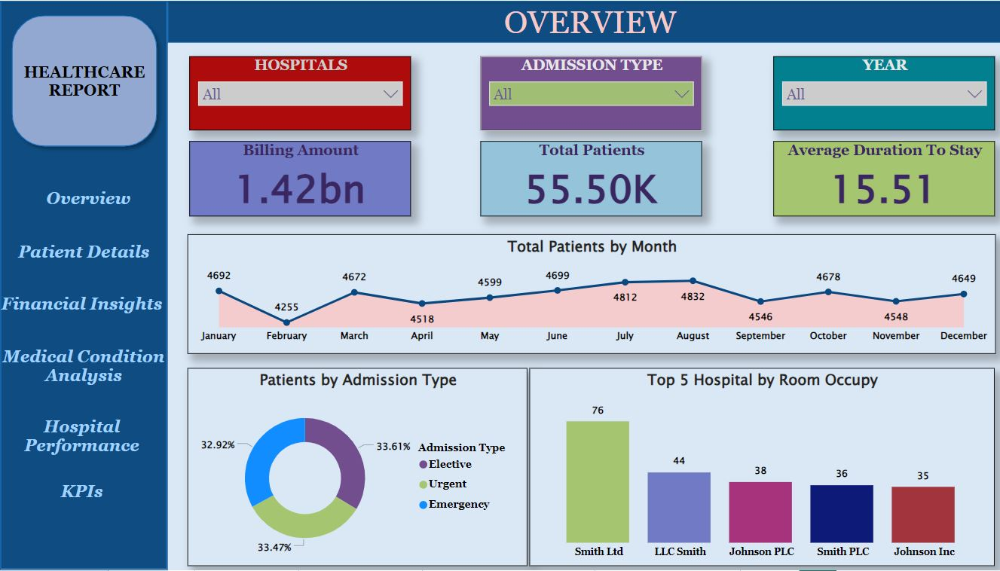

# Healthcare_Data_Analytics

## OVERVIEW

-Dedicated to creating and experimenting with interactive data visualizations, transforming raw data into compelling visual stories.
This Power BI project presents a comprehensive dashboard that integrates and visualizes key healthcare data, including patient details, hospital information, payment records, doctor assignments, room utilization, test results, diagnoses, and patients' medication. The data is cleaned and preprocessed using Python to ensure consistency and accuracy across multiple datasets. Advanced DAX queries are employed to calculate key performance indicators (KPIs) related to patient care, hospital operations, financial performance, and medication management. These KPIs provide insights into patient flow, treatment outcomes, medication usage, resource allocation, and financial health. The dashboard enables healthcare administrators to make data-driven decisions that optimize hospital performance, enhance patient care, improve medication management, and streamline operational efficiency.

